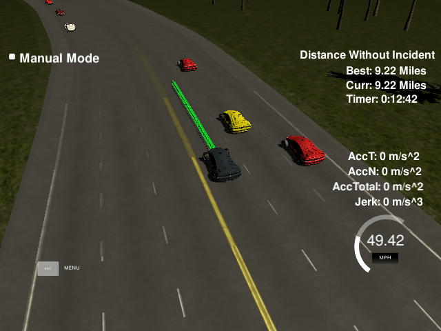
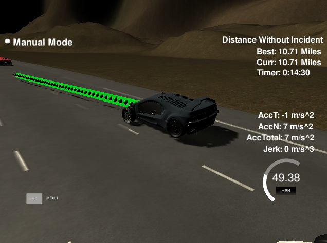
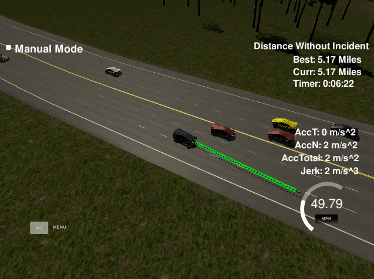
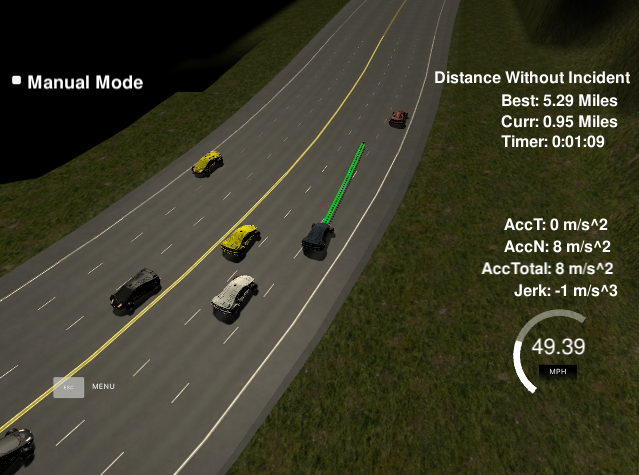
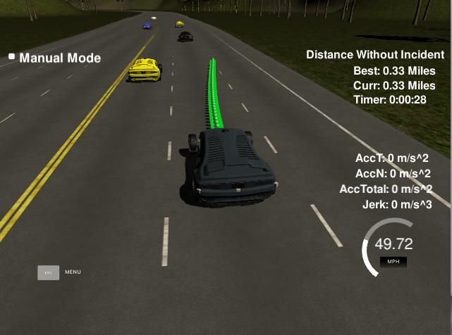
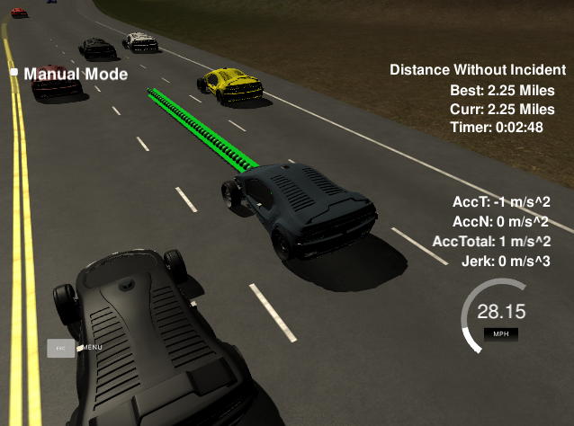
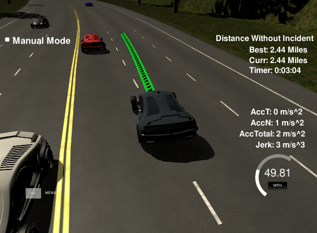
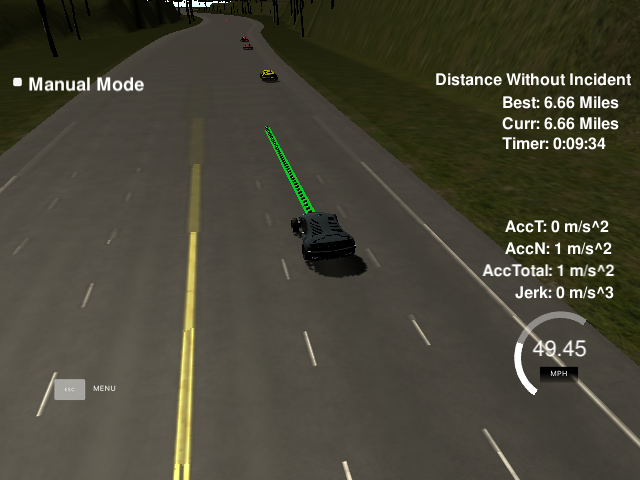

# Path Planning

In this project I designed a path planner that is able to create smooth and safe paths for the autonomous car in a highway with traffic.

The autonomous car was able to safely drive in the highway for more than 10 miles without any incident.

<table>
    <tr>
        <td></td>
        <td></td>
    </tr>
</table>

## Path Generation

The path is generated using a spline that interpolates a set of points to generate a smooth path when keeping the same lane or while changing to the other lanes.

<table>
    <tr>
        <td></td>
        <td></td>
    </tr>
</table>


## Max Acceleration and Jerk

The maximum acceleration and jerk are controlled by incrementing the speed gradually over time. Any dramatic increase of velocity will result in a high acceleration and jerk. To avoid that, the speed is increased in small steps multiple of 0.1 m/s or 0.224 mph.

## Collision Avoidance

Using the sensor fusion data the car keep a safety gap from all other vehicles.
If it gets too close to the vehicle in front, it will slowly decelerate to recover the safety distance gap.

<table>
    <tr>
        <td></td>
        <td></td>
    </tr>
</table>


## Lane Keeping

The car will try to stay in the center lane as much as possible and it will use the location of the other vehicles to decide if it is feasible to change the lane.

<table>
    <tr>
        <td></td>
        <td></td>
    </tr>
</table>


## State Machine

A state machine was used to trigger different behavior depending on the current state of the autonomous car.

A safety gap surrounding the vehicle was setup as part of the state machine conditions. Only when the measurements indicate that the vehicle has a safe gap to make a lane change or to accelerate will proceed with the changes.

The value of these gaps were obtained empirically from analyzing the behavior of the car in several trials.

## Output

Here is an example of the debug output:

```
  = other car  7   s: 1678.57   d: 10.02   speed: 14.38
  = other car  8   s: 1673.31   d:  2.05   speed: 12.75
  = other car  9   s: 1725.26   d:  1.73   speed: 16.01
  = other car 10   s: 1770.58   d:  5.87   speed: 17.55
  = other car 11   s: 2014.50   d:  5.76   speed: 16.53
  autonomous car   s: 1827.71   d:  9.98   speed: 49.37
    = too close front: 0
    = too close left:  1
    = too close right: 0
```
